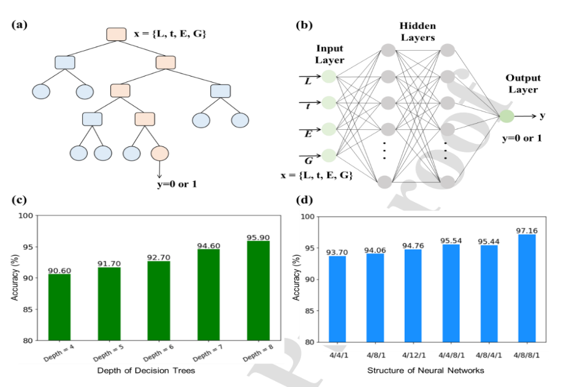

# Design-analysis-of-a-sea-robot-using-machine-learning-
 #### Critical analysis on Machine- learning-accelerated design of functional structural components in deep-sea soft robots 
 To explore the deepest regions of the ocean with high flexibility and environmental
adaptability, a soft sea robot is designed using traditional design method and machine
learning method and then compared. Main objective is to research on the design of
miniature pressure vessels on the printed circuit board to protect vulnerable electronic
components on PCB for enhancing the reliability of deep-sea soft robots.

     
    

  
